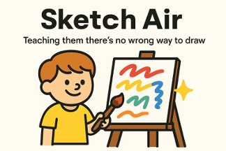

<h1 align="center">✨ Sketch Air</h1>

  

  <b>Sketch Air</b> lets you draw in mid-air using just your hand and a webcam. 
  Your sketches are then transformed into <b>beautiful artwork by AI</b>.

---

## 🚀 Quick Start

<ol>
  <li>
    <b>Install dependencies</b>
     
    <pre><code>npm install</code></pre>
  </li>
  <li>
    <b>Start the app</b>
     
    <pre><code>npm run dev</code></pre>
  </li>
  <li>
    <b>Open in your browser</b>
     
    Visit <a href="http://localhost:3000">http://localhost:3000</a>
  </li>
</ol>

  Built with ❤️ for <b>AI Hackathon</b>

